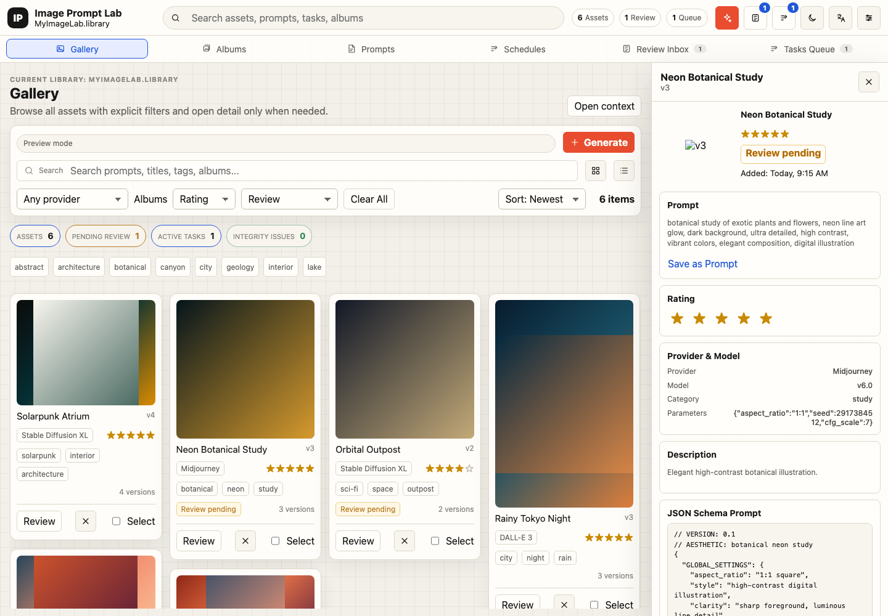
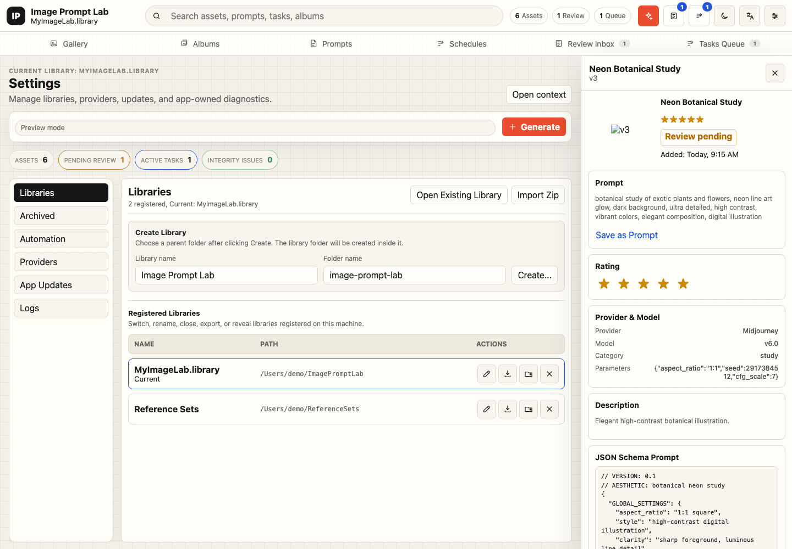

# Image Prompt Lab Gallery

[中文文档](README_zh.md)

Image Prompt Lab Gallery is a local-first desktop application for managing AI image-generation prompts, generated images, metadata, albums, and asset version lineage.

The current MVP is built around a Tauri + React desktop shell, a Rust core business layer, SQLite-backed managed resource libraries, and a CLI for automation and batch workflows.

## Status

This project is under active MVP development. The stable baseline is:

- Latest desktop release: `v0.1.6`. See [GitHub Releases](https://github.com/danshan/image-prompt-lab-gallery/releases/latest).
- Cross-platform desktop shell with Tauri, React, and TypeScript.
- Rust workspace with `imglab-core` as the shared DDD business core for desktop, CLI, and daemon write operations.
- Local managed resource libraries backed by SQLite and filesystem storage.
- GUI-first workflow with CLI support for automation.
- Text-to-image and image-to-image service boundaries.
- Asset-level version lineage with Gallery version tree inspection and version promotion.
- First-class Prompt Workspace with prompt documents, version history, variables, and generation lineage.
- Scheduled image generation through the local daemon task runtime.
- Library content lifecycle workflows for comparing, merging, deduplicating, and cleaning up local libraries.
- Human-reviewed AI metadata suggestions before canonical metadata updates.
- Available image providers: `fake` and Codex CLI imagegen adapter.
- Grok provider crate exists as a boundary, with native implementation deferred.

## Screenshots





## Feature Overview

- **Gallery**: browse all managed assets, filter by provider, album, rating, and review state, inspect selected asset details, and open version lineage for generated images.
- **Albums**: manage manual and smart collections without making album selection an implicit Gallery scope.
- **Prompt Workspace**: create prompt documents, track prompt versions, run prompt versions through generation, and preserve prompt-to-image lineage.
- **Generation and schedules**: run text-to-image and image-to-image workflows, queue daemon-backed generation tasks, and configure recurring scheduled image generation.
- **Review Inbox**: inspect AI metadata suggestions before applying them to canonical asset metadata.
- **Settings**: manage local libraries, providers, app updates, automation diagnostics, and logs from a compact desktop console.
- **CLI**: initialize libraries, import assets, search, generate images, and automate batch operations from scripts.

## Repository Layout

```text
apps/desktop              Tauri and React desktop application
crates/imglab-core        DDD core: domain, application ports/use cases, infrastructure adapters
crates/imglab-cli         CLI for library, asset, search, generation, album, and metadata workflows
crates/imglab-provider-codex
                          Codex CLI imagegen provider adapter
crates/imglab-provider-grok
                          Grok provider boundary placeholder
docs/development.md       Local development and validation notes
docs/providers.md         Provider behavior and configuration notes
openspec/specs            Current product and architecture specifications
openspec/changes          Proposed and archived spec-driven changes
```

`imglab-core` is organized around explicit boundaries:

- `domain`: business invariants and reusable policies.
- `application`: ports, use cases, read models, and the `ImgLabApplication` facade.
- `infrastructure`: SQLite, filesystem, registry, and provider composition adapters.
- `interface_contracts`: runtime-facing DTO compatibility surface.

Runtime layers should call the application facade or explicit interface contracts instead of duplicating generation planning, asset version allocation, task transitions, or library mutation semantics.

## Prerequisites

- Rust stable toolchain.
- Node.js and npm.
- Platform prerequisites for Tauri 2.
- A local `codex` CLI session if you want to use the Codex CLI imagegen provider.

SQLite is used through Rust dependencies; no separate SQLite server is required.

## Desktop Release

The current desktop release path is a macOS Tauri build published through GitHub Releases. Release builds include updater artifacts and `latest.json` for the Tauri updater endpoint.

Current release signing uses macOS ad-hoc signing plus Tauri updater signing. It is not Apple Developer ID notarization, so first-open Gatekeeper behavior can still require user intervention.

See [docs/release.md](docs/release.md) for version discipline, signing boundaries, required GitHub secrets, and release verification steps.

## Quick Start

Run core checks from the repository root:

```bash
cargo fmt --all -- --check
cargo clippy --workspace --all-targets -- -D warnings
cargo test --workspace
npm run build --prefix apps/desktop
scripts/check-architecture.sh
```

Build and run the desktop frontend:

```bash
cd apps/desktop
npm install
npm run build
npm run dev -- --host 127.0.0.1
```

Run the full Tauri desktop app:

```bash
cd apps/desktop
npm run tauri dev
```

See [docs/development.md](docs/development.md) for more development commands.

## CLI Usage

Use an isolated registry during development to avoid mixing test libraries with your default local state:

```bash
export IMGLAB_REGISTRY=/tmp/imglab-dev-registry.sqlite
cargo run --offline -p imglab-cli -- init /tmp/imglab-library --name Dev
cargo run --offline -p imglab-cli -- import --library /tmp/imglab-library /tmp/source.png --json
cargo run --offline -p imglab-cli -- search --library /tmp/imglab-library --json
cargo run --offline -p imglab-cli -- generate --library /tmp/imglab-library --provider fake --prompt "test image" --json
```

Use `--dry-run` for supported write operations when you want to preview effects:

```bash
cargo run --offline -p imglab-cli -- import --library /tmp/imglab-library /tmp/source.png --dry-run --json
cargo run --offline -p imglab-cli -- generate --library /tmp/imglab-library --provider fake --prompt "test image" --dry-run --json
```

## Providers

The MVP separates providers into two categories:

- Experimental CLI providers reuse a local command and its existing authentication state.
- Stable native providers call public APIs through explicit credentials.

Currently available providers:

- `fake`: deterministic local smoke-test provider.
- `codex-cli` / `codex`: invokes local `codex exec` and imports the generated image back into the managed library.

Native OpenAI API and Grok providers are intentionally deferred until their stable implementation boundaries are finalized.

See [docs/providers.md](docs/providers.md) for provider details.

## Resource Library Model

A resource library is a managed local directory containing:

- `manifest.json`
- `library.sqlite`
- `originals/imported`
- `originals/generated`
- `exports`

SQLite is the authoritative index. Exported sidecar files are for migration, debugging, and external tooling.

## Specification Workflow

This repository uses an OpenSpec-style workflow for product, architecture, and behavior changes. Current specifications live in [openspec/specs](openspec/specs), while active and archived changes live in [openspec/changes](openspec/changes).

For substantial behavior changes, update or create the relevant OpenSpec artifacts before implementation.

## License

This project is licensed under the [MIT License](LICENSE).
