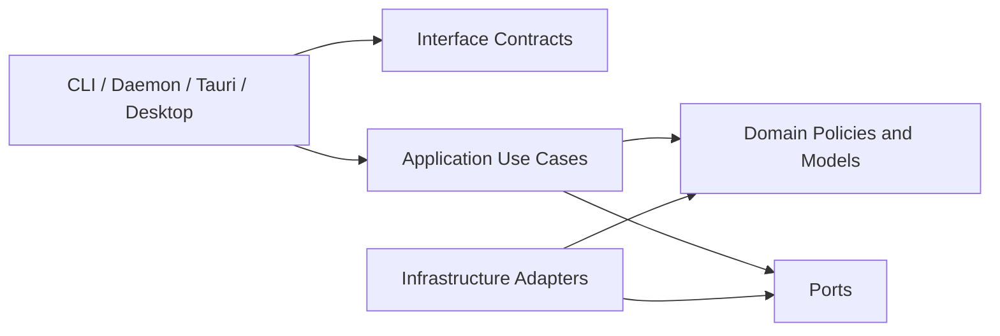
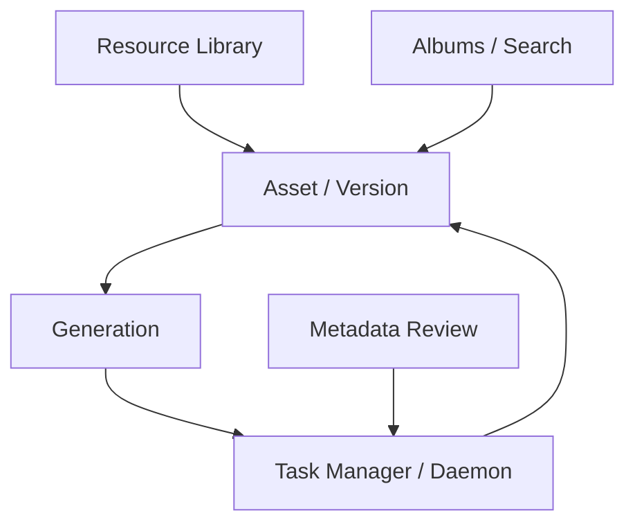
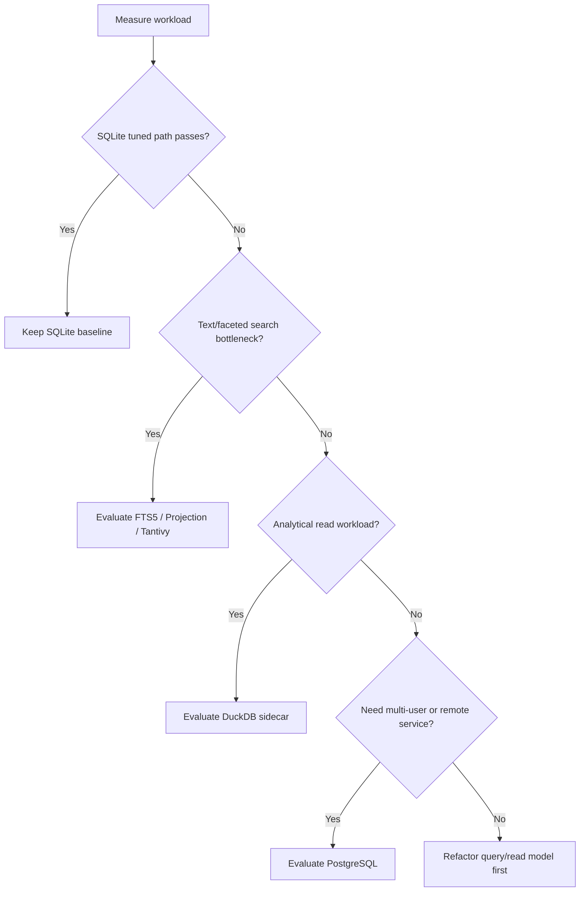

# DDD Systematic Code Review

## Executive Summary

The project already has a meaningful DDD split in `imglab-core`, and the current `scripts/check-architecture.sh` guardrail passes. The remaining risk is not an obvious dependency-direction failure. The deeper issue is transitional ownership: legacy `library/*` services, application use cases, runtime adapters, daemon scheduling, frontend controllers, and query/read-model code still overlap in ways that can make future behavior changes hard to reason about.

The most important next step is a staged architecture refactor, not a mechanical file split. Business rules should have one primary owner, runtime adapters should stay thin, persistence adapters should persist decisions rather than create them, and performance/storage decisions should be made from workload evidence.

Highest-priority risks:

- Legacy service and application use cases still coexist as primary-looking boundaries in runtime code.
- Gallery, smart album, version tree, and task read paths need workload evidence before choosing SQLite tuning, FTS5/projections, Tantivy, DuckDB, or PostgreSQL.
- `StudioAppController.tsx`, `library/gallery.rs`, `library/tasks.rs`, and `library/tests.rs` remain large enough to hide ownership and duplication problems.
- Task transition and generation execution behavior spans core, daemon, and provider boundaries, increasing the risk of duplicated decisions.

Recommended route: create `systematic-ddd-architecture-refactor` as a staged OpenSpec change. The first wave preserves behavior and establishes baselines; later waves consolidate boundaries, harden read models, clean runtime/frontend ownership, and strengthen tests/guardrails.

## Scope and Constraints

Scope:

- Rust core, CLI, daemon, Tauri backend, desktop frontend, SQLite resource library, OpenSpec specs, and architecture guardrails.
- DDD boundaries, bounded context ownership, runtime adapter responsibilities, persistence/query engine choices, performance risks, code health, and verification strategy.

Preserve unless a spec explicitly defines otherwise:

- CLI JSON output.
- Daemon loopback API.
- Tauri command payloads.
- `manifest.json` identity and portable metadata.
- `library.sqlite` compatibility.
- Managed image file layout.
- Registry alias, unregister, backup/restore, and clone-on-conflict semantics.
- Existing resource library readability.

Deferred:

- Visual redesign.
- Multi-user collaboration.
- Cloud sync.
- Library encryption.
- Mandatory PostgreSQL migration.
- Remote service expansion.

## Current Architecture Snapshot

`imglab-core` currently exposes `domain`, `application`, `infrastructure`, `interface_contracts`, and legacy compatibility surfaces. This is directionally correct. Domain/application dependency checks pass, and the current architecture guardrail catches direct imports from domain/application into infrastructure/runtime boundaries.

The current transitional areas are:

- `crates/imglab-core/src/library/*` still contains large service, repository, and read-model implementations.
- `crates/imglab-core/src/infrastructure/composition.rs` wires application use cases using `LocalLibraryService`, which keeps the service as a key adapter and compatibility owner.
- CLI and daemon code still reference `LocalLibraryService` directly in selected paths.
- Desktop workflow modules exist, but `StudioAppController.tsx` remains a large cross-workflow orchestration owner.
- Query/read-model code for gallery, version tree, smart albums, and task outputs is functional but needs workload-based validation.

## Findings

### DDD Boundary Findings

Finding ID: DDD-001  
Severity: High  
Area: DDD  
Evidence: `crates/imglab-core/src/infrastructure/composition.rs` wires application use cases through `LocalLibraryService`; `crates/imglab-cli/src/main.rs` and `crates/imglab-daemon/src/runtime.rs` still expose direct `LocalLibraryService` paths.  
Problem: The DDD split is real, but `LocalLibraryService` can still appear as both compatibility facade and primary business owner.  
Impact: New behavior can enter the wrong layer and recreate competing owners for versioning, task behavior, generation planning, or metadata review.  
Recommendation: Define application use cases as the primary owner for migrated behavior. Keep legacy service usage explicitly bounded as compatibility, adapter, or transitional infrastructure.  
Validation: Extend architecture checks for new runtime direct-use paths and document each allowed compatibility exception.

Finding ID: DDD-002  
Severity: High  
Area: Bounded Context  
Evidence: `crates/imglab-core/src/library/gallery.rs` combines gallery query, detail loading, version tree, album filters, smart album filtering, task origin lookups, and file context behavior.  
Problem: Multiple query models and context-specific rules share one large owner.  
Impact: Performance tuning or behavior changes can accidentally affect unrelated workflows.  
Recommendation: Split query-side ownership by gallery list, asset detail, version tree, album filters, and shared predicate spec.  
Validation: Focused query tests plus compatibility regression tests for gallery, smart album, and version tree behavior.

Finding ID: DDD-003  
Severity: Medium  
Area: DDD  
Evidence: `crates/imglab-core/src/application/use_cases/generation.rs` is one of the largest application files and works near provider, file, generation event, and asset version concerns.  
Problem: Generation remains a dense orchestration boundary with several reasons to change.  
Impact: Provider changes, image-to-image lineage changes, and metadata suggestion handoff can become coupled.  
Recommendation: Review generation planning, provider execution, output import, and event persistence as separate application steps with explicit ports.  
Validation: Focused generation use-case tests for operation inference, reference source behavior, and provider output handling.

### Runtime Adapter Findings

Finding ID: RUNTIME-001  
Severity: Medium  
Area: Runtime  
Evidence: `crates/imglab-cli/src/main.rs` passes `LocalLibraryService` through many command helpers while also constructing `sqlite_application`.  
Problem: CLI command code still exposes the legacy service as a visible command boundary.  
Impact: CLI changes can bypass application-level use cases or normalize behavior differently from daemon/Tauri.  
Recommendation: Move command handlers toward application/facade entrypoints and keep direct service usage only where explicitly compatible.  
Validation: CLI contract tests for JSON shape and behavior-preserving command flows.

Finding ID: RUNTIME-002  
Severity: High  
Area: Runtime  
Evidence: `crates/imglab-daemon/src/scheduler.rs` performs provider dispatch and task output linking around generation use case execution.  
Problem: Daemon owns execution concerns, but output-link and task transition semantics need a clear core owner.  
Impact: Retrying, cancellation, output links, and generation lineage can drift across daemon and core.  
Recommendation: Keep daemon focused on ticking, cancellation markers, process/log boundary, and loopback transport. Move task transition and output-link policies toward core task/generation application services.  
Validation: daemon scheduler tests, task transition tests, and generation output contract tests.

Finding ID: RUNTIME-003  
Severity: Medium  
Area: Runtime  
Evidence: Tauri services construct `sqlite_application`, while command modules map many GUI commands.  
Problem: Tauri is directionally an adapter, but command-level complexity can grow into view mapping plus behavior ownership.  
Impact: GUI behavior can diverge from CLI/daemon if command handlers accumulate decisions.  
Recommendation: Keep Tauri commands limited to input validation, path handling, provider selection, application calls, and error/view mapping.  
Validation: Tauri crate checks and command contract tests where practical.

### Persistence and Query Engine Findings

Finding ID: DB-001  
Severity: High  
Area: Persistence  
Evidence: SQLite schema has many relevant indexes, but gallery/version-tree/smart-album paths still perform broad read-model assembly.  
Problem: Index presence alone does not prove target workload sufficiency.  
Impact: Large libraries can expose slow gallery/search/version-tree workflows or lock contention.  
Recommendation: Establish a SQLite sufficiency checkpoint with synthetic library fixtures, query timing, query-count evidence, and `EXPLAIN QUERY PLAN`.  
Validation: Benchmark or smoke script for thousands-level assets, versions, tags, albums, suggestions, and tasks.

Finding ID: DB-002  
Severity: Medium  
Area: Persistence  
Evidence: Search, gallery filtering, smart album filtering, and text matching currently lean on SQLite plus in-process filtering.  
Problem: The system lacks an explicit decision tree for when to add FTS5, projection tables, Tantivy, DuckDB, or PostgreSQL.  
Impact: Future DB decisions may be made reactively and increase migration risk.  
Recommendation: Add persistence/search engine decision gates to `resource-library` specs.  
Validation: OpenSpec scenarios for migration, rollback, backup/restore, index rebuild, and repair.

Finding ID: DB-003  
Severity: Medium  
Area: Persistence  
Evidence: `resource-library` compatibility requirements already protect schema and file layout, but supplemental index semantics are not yet specified.  
Problem: Introducing a sidecar index or alternate DB without a rebuild/repair story would weaken local-first durability.  
Impact: Backup/restore and repair behavior can become ambiguous.  
Recommendation: Treat all supplemental indexes as rebuildable from SQLite unless a future spec explicitly promotes them to authoritative storage.  
Validation: Rebuild tests and backup/restore smoke tests for any selected sidecar.

### Performance Findings

Finding ID: PERF-001  
Severity: High  
Area: Performance  
Evidence: `library/gallery.rs` loads broad maps for tags, pending review counts, task origins, version counts, version trees, and album memberships.  
Problem: This can be acceptable at small scale, but the target library size is not encoded as a testable performance contract.  
Impact: Performance regressions can stay invisible until real libraries grow.  
Recommendation: Add target-size fixtures and classify each broad load as acceptable, optimized, paginated, projected, or deferred.  
Validation: Repeatable benchmark or smoke command that records query timing and result counts.

Finding ID: PERF-002  
Severity: Medium  
Area: Performance  
Evidence: Desktop polling intervals and refresh fan-out are centralized around task and metadata workflows.  
Problem: Refresh storms can trigger repeated full gallery/suggestion/task reads after write-heavy workflows.  
Impact: UI responsiveness and SQLite contention can degrade during generation/review batches.  
Recommendation: Define refresh policy by workflow, including debounce, background polling, stale-while-refresh behavior, and event-driven replacement candidates.  
Validation: Frontend tests for action fan-out and smoke checks for task queue updates.

Finding ID: PERF-003  
Severity: Medium  
Area: Performance  
Evidence: Task queue selection uses scheduler logic plus persisted queue order and status queries.  
Problem: Scheduler behavior is currently tested, but workload shape and concurrency pressure are not part of a broader performance checkpoint.  
Impact: Large task histories can slow list/detail operations or retry loops.  
Recommendation: Include task queue, task outputs, events, attempts, and log-tail paths in the synthetic workload.  
Validation: Scheduler and API tests with larger task sets.

### Frontend Workflow Findings

Finding ID: FE-001  
Severity: Medium  
Area: Frontend  
Evidence: `apps/desktop/src/app/StudioAppController.tsx` remains a large orchestrator with many effects, workflow actions, slots, and cross-workflow refreshes.  
Problem: Composition, transport orchestration, cross-workflow state transitions, and UI slots remain tightly coupled.  
Impact: Future workflow changes are harder to reason about and easier to regress.  
Recommendation: Continue moving async actions and workflow state ownership into workflow-owned controller modules.  
Validation: Desktop tests and build; file-size/ownership scan for controller regression.

Finding ID: FE-002  
Severity: Medium  
Area: Frontend  
Evidence: Workflow screen files such as inspector, albums, settings, tasks, and review remain large.  
Problem: Large screens can mix rendering, interaction decisions, derived state, and workflow action wiring.  
Impact: UI behavior changes can become hard to isolate.  
Recommendation: Split only when a screen has multiple reasons to change, such as repeated row rendering, drawer state, form sections, or action menus.  
Validation: Existing frontend tests plus targeted component tests for split modules.

### Code Health Findings

Finding ID: HEALTH-001  
Severity: Medium  
Area: Code Health  
Evidence: `library/tests.rs`, `library/gallery.rs`, `library/tasks.rs`, `application/use_cases/generation.rs`, `StudioAppController.tsx`, and several workflow screen/action files are large hotspots.  
Problem: Size alone is not the bug, but these files combine several reasons to change.  
Impact: Reviews become expensive and duplicated rules are easier to introduce.  
Recommendation: Split by ownership and change reason, not by arbitrary line count.  
Validation: Owner-local tests and hotspot report after each refactor wave.

Finding ID: HEALTH-002  
Severity: Medium  
Area: Code Health  
Evidence: Gallery/smart album filtering, task output linking, version tree mapping, and frontend refresh fan-out show repeated concepts across modules.  
Problem: Repetition at business-rule boundaries can produce semantic drift.  
Impact: Similar workflows may disagree about filtering, task output payloads, or refresh behavior.  
Recommendation: Extract shared policy or query specification only where there is real semantic reuse.  
Validation: Tests for shared behavior and explicit adapter tests for intentional differences.

### Testing and Guardrail Findings

Finding ID: TEST-001  
Severity: Medium  
Area: Tests  
Evidence: `crates/imglab-core/src/library/tests.rs` is a large cross-context regression suite.  
Problem: Regression suites are useful, but new rule tests should live near domain/application/infrastructure owners.  
Impact: New logic can be tested only through expensive broad flows.  
Recommendation: Keep large tests for compatibility and require new rule tests near owning modules.  
Validation: Test inventory in OpenSpec tasks and focused tests for migrated rules.

Finding ID: TEST-002  
Severity: Medium  
Area: Tests  
Evidence: `scripts/check-architecture.sh` currently checks dependency direction and selected runtime bypass patterns.  
Problem: It does not yet report large-owner regressions, allowed compatibility exceptions, or persistence/search decision evidence.  
Impact: Future regressions can pass dependency checks while increasing complexity.  
Recommendation: Extend guardrails in later waves to include hotspot reporting, direct legacy-service usage, frontend compatibility barrels, and persistence decision checks.  
Validation: Guardrail script tests or documented expected output.

## Persistence and Query Engine Options

SQLite remains the baseline because it supports local-first portability, a simple distribution model, and transactional metadata inside each resource library. The review still recommends evaluating other options with evidence.

### Option 1: SQLite Tuning

Use better indexes, query plans, WAL settings, transaction boundaries, and pagination/projection improvements while keeping SQLite as the only authoritative store.

Best fit:

- Current local-first resource library.
- Transactional asset/version/task metadata.
- Low operational complexity.

Risk:

- Complex search and faceted filtering may outgrow ad hoc query/in-process filtering.

### Option 2: SQLite FTS5 and Projection Tables

Add FTS5 or projection tables for text search and gallery read models while keeping SQLite authoritative.

Best fit:

- Search/filter performance bottlenecks where local-first portability must remain.
- Rebuildable derived read models.

Risk:

- Projection consistency, backfill, repair, and migration complexity.

### Option 3: Tantivy Embedded Index

Use Tantivy as a rebuildable sidecar for full-text and faceted search.

Best fit:

- Search workloads exceed SQLite/FTS5 ergonomics.
- Index can be rebuilt from SQLite.

Risk:

- Dual-write or eventual-consistency policy.
- Backup/restore and repair semantics must include index rebuild behavior.

### Option 4: DuckDB Analytical Sidecar

Use DuckDB for analytical or report-like read models.

Best fit:

- Aggregation-heavy, report-like, or ad hoc analytical workloads.

Risk:

- Not ideal as the primary high-frequency OLTP store for small transactional metadata writes.

### Option 5: PostgreSQL or Another Client-Server DB

Plan PostgreSQL for future remote service, collaboration, or multi-user scenarios.

Best fit:

- Cloud sync, collaboration, remote service, or multi-user workflows.

Risk:

- Conflicts with current local-first portable library distribution.
- Raises installation, migration, backup, and support complexity.

## Target Architecture

Target dependency direction:



Bounded context map:



Persistence decision tree:



## Refactor Roadmap

1. Audit and baseline.
2. Core boundary consolidation.
3. Persistence/search decision and read-model hardening.
4. Runtime and frontend ownership cleanup.
5. Tests, guardrails, and closeout.

## Verification Strategy

Use the smallest sufficient verification per wave, then full closeout:

```bash
scripts/check-architecture.sh
cargo fmt --all --check
cargo test -p imglab-core
cargo test -p imglab-cli
cargo test -p imglab-daemon
cargo test -p imglab-desktop
npm test --prefix apps/desktop
npm run build --prefix apps/desktop
openspec validate systematic-ddd-architecture-refactor --strict
openspec validate --specs --strict
git diff --check
```

Performance verification should include at least one reproducible synthetic library fixture or benchmark script before recommending a persistence/search engine change.

## Deferred / Non-Goals

- Visual redesign.
- Multi-user collaboration.
- Cloud sync.
- Library encryption.
- Mandatory PostgreSQL migration.
- Remote service expansion.
