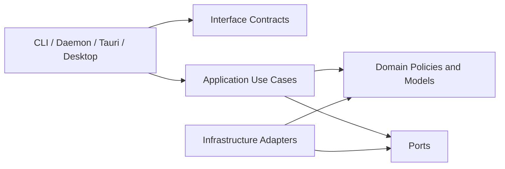
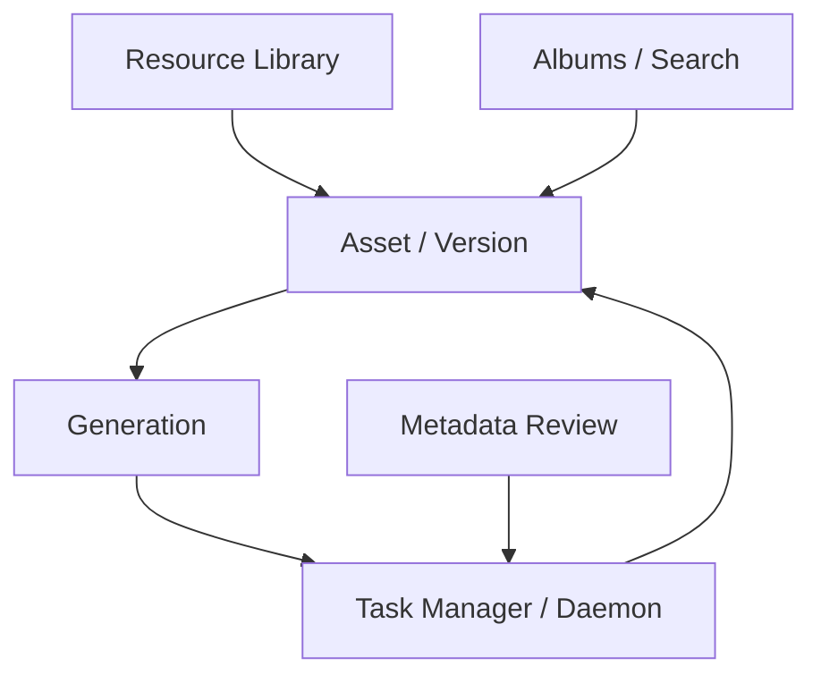
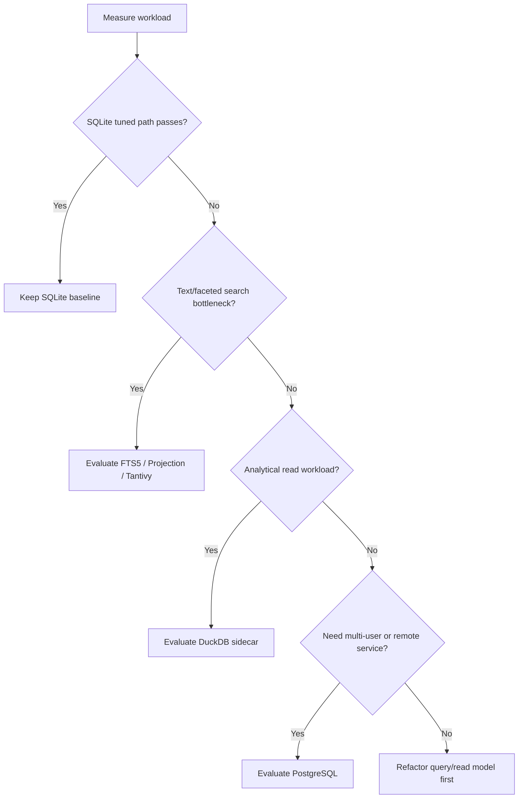

# Systematic DDD Architecture Review Implementation Plan

> **For agentic workers:** REQUIRED SUB-SKILL: Use superpowers:subagent-driven-development (recommended) or superpowers:executing-plans to implement this plan task-by-task. Steps use checkbox (`- [ ]`) syntax for tracking.

**Goal:** Produce a systematic DDD-oriented architecture review and OpenSpec change that can drive staged project-wide refactoring.

**Architecture:** This plan is artifact-first. It creates a review document with concrete findings, then converts those findings into OpenSpec proposal, design, tasks, and spec deltas. It does not implement code refactors; it prepares the approved architecture and development task backlog.

**Tech Stack:** Markdown, OpenSpec artifacts, Rust workspace scans, React/Tauri desktop project evidence, existing repo validation scripts.

---

## File Structure

- Create: `docs/architecture/ddd-systematic-code-review.md`
  - Owns the complete repo-wide review, evidence, findings, target DDD architecture, DB/search options, and refactor roadmap.
- Create: `openspec/changes/systematic-ddd-architecture-refactor/proposal.md`
  - Owns the change problem statement, goals, non-goals, impact, and staged proposal.
- Create: `openspec/changes/systematic-ddd-architecture-refactor/design.md`
  - Owns architecture decisions, target boundaries, persistence/search decision gate, and validation strategy.
- Create: `openspec/changes/systematic-ddd-architecture-refactor/tasks.md`
  - Owns development tasks grouped into auditable waves.
- Create: `openspec/changes/systematic-ddd-architecture-refactor/specs/core-ddd-architecture/spec.md`
  - Extends DDD ownership and runtime bypass requirements.
- Create: `openspec/changes/systematic-ddd-architecture-refactor/specs/performance-code-health/spec.md`
  - Extends systematic review, hotspot, duplication, and complexity requirements.
- Create: `openspec/changes/systematic-ddd-architecture-refactor/specs/resource-library/spec.md`
  - Adds persistence/query engine decision, migration, backup, and rollback requirements.
- Create: `openspec/changes/systematic-ddd-architecture-refactor/specs/task-manager-daemon/spec.md`
  - Adds task transition ownership and daemon scheduler boundary requirements.
- Create: `openspec/changes/systematic-ddd-architecture-refactor/specs/desktop-workbench/spec.md`
  - Adds workflow ownership, controller complexity, and refresh/polling requirements.

## Task 1: Reproduce Evidence Scans

**Files:**
- Read: `docs/superpowers/specs/2026-05-23-systematic-ddd-architecture-review-design.md`
- Read: `openspec/specs/core-ddd-architecture/spec.md`
- Read: `openspec/specs/performance-code-health/spec.md`
- Read: `scripts/check-architecture.sh`

- [ ] **Step 1: Confirm clean working tree**

Run:

```bash
git status --short
```

Expected: no output, or only known files created by this plan after work begins.

- [ ] **Step 2: Run architecture guardrail**

Run:

```bash
scripts/check-architecture.sh
```

Expected: `Architecture dependency check passed`.

- [ ] **Step 3: Capture largest Rust files**

Run:

```bash
find crates -type f -name '*.rs' | xargs wc -l | sort -nr | head -40
```

Expected: output includes current Rust hotspots such as `crates/imglab-core/src/library/tests.rs`, `crates/imglab-core/src/library/gallery.rs`, `crates/imglab-core/src/library/tasks.rs`, and `crates/imglab-core/src/application/use_cases/generation.rs`.

- [ ] **Step 4: Capture largest desktop files**

Run:

```bash
find apps/desktop/src -type f \( -name '*.ts' -o -name '*.tsx' \) | xargs wc -l | sort -nr | head -40
```

Expected: output includes current frontend hotspots such as `apps/desktop/src/app/StudioAppController.tsx`, workflow screens, controller action files, and `apps/desktop/src/app/types.ts`.

- [ ] **Step 5: Capture runtime bypass candidates**

Run:

```bash
rg -n "LocalLibraryService|sqlite_application|ImgLabApplication|application::|interface_contracts|dto::|library::" crates/imglab-cli/src crates/imglab-daemon/src apps/desktop/src-tauri/src crates/imglab-provider-* -g '*.rs'
```

Expected: output identifies direct legacy service references and application facade usage that the review document will classify.

- [ ] **Step 6: Capture performance suspect paths**

Run:

```bash
rg -n "SELECT|JOIN|ORDER BY|LIMIT|OFFSET|query_map|prepare\\(|setInterval|setTimeout|poll|refresh|useEffect\\(" crates/imglab-core/src/infrastructure crates/imglab-core/src/library crates/imglab-daemon/src apps/desktop/src -g '*.rs' -g '*.ts' -g '*.tsx'
```

Expected: output identifies query-heavy and polling/refresh-heavy paths for review evidence.

## Task 2: Write Systematic Review Document

**Files:**
- Create: `docs/architecture/ddd-systematic-code-review.md`

- [ ] **Step 1: Create the architecture docs directory if missing**

Run:

```bash
mkdir -p docs/architecture
```

Expected: directory exists.

- [ ] **Step 2: Write the review document**

Create `docs/architecture/ddd-systematic-code-review.md` with this complete structure:

```markdown
# DDD Systematic Code Review

## Executive Summary

The project already has a meaningful DDD split in `imglab-core`, but several primary ownership boundaries are still transitional. The most important next step is not a mechanical file split. The project needs an evidence-driven architecture refactor that makes application use cases the primary owner for business behavior, narrows legacy `library/*` responsibilities, validates persistence/search workload assumptions, and reduces frontend/runtime orchestration complexity without changing public behavior.

Highest-priority risks:

- Legacy service and application use cases still coexist as primary-looking boundaries in runtime code.
- Gallery, smart album, version tree, and task read paths need workload evidence before choosing SQLite tuning, FTS5/projections, Tantivy, DuckDB, or PostgreSQL.
- `StudioAppController.tsx`, `library/gallery.rs`, `library/tasks.rs`, and `library/tests.rs` remain large enough to hide ownership and duplication problems.
- Task transition and generation execution behavior spans core, daemon, and provider boundaries, which increases the risk of duplicated decisions.

Recommended route: create `systematic-ddd-architecture-refactor` as a staged OpenSpec change. The first wave should preserve behavior and establish baselines; later waves should consolidate boundaries, harden read models, clean runtime/frontend ownership, and strengthen tests/guardrails.

## Scope and Constraints

- Scope: Rust core, CLI, daemon, Tauri backend, desktop frontend, SQLite resource library, OpenSpec specs, architecture guardrails.
- Preserve: CLI JSON, daemon API, Tauri command payloads, `manifest.json`, `library.sqlite`, managed file layout, backup/restore semantics, existing library compatibility.
- Defer: visual redesign, multi-user collaboration, cloud sync, encryption, remote service expansion, mandatory PostgreSQL migration.

## Current Architecture Snapshot

`imglab-core` contains `domain`, `application`, `infrastructure`, `interface_contracts`, and legacy compatibility surfaces. Runtime crates and desktop adapters increasingly use application/facade boundaries, but legacy `library/*` modules still contain substantial behavior and persistence orchestration.

## Findings

### DDD Boundary Findings

Finding ID: DDD-001
Severity: High
Area: DDD
Evidence: `crates/imglab-core/src/infrastructure/composition.rs` still wires use cases through `LocalLibraryService`; runtime code still references `LocalLibraryService` directly in selected paths.
Problem: The boundary is improved but still transitional. `LocalLibraryService` can look like both compatibility facade and primary business owner.
Impact: New behavior can be added through the wrong layer, recreating competing owners.
Recommendation: Define use case owners as primary for migrated write flows. Keep legacy service as bounded adapter/compatibility surface.
Validation: Extend architecture checks for new direct legacy-service use in runtime modules and application modules.

Finding ID: DDD-002
Severity: High
Area: Bounded Context
Evidence: `crates/imglab-core/src/library/gallery.rs` combines gallery query, smart album filtering, version tree, detail loading, album context, and file context.
Problem: Multiple query models and context-specific rules share one large implementation owner.
Impact: Performance tuning and behavior changes can accidentally affect unrelated workflows.
Recommendation: Split query-side ownership by gallery list, asset detail, version tree, album filters, and shared predicate spec.
Validation: Focused query tests and compatibility regression tests for gallery, smart album, and version tree behavior.

### Runtime Adapter Findings

Finding ID: RUNTIME-001
Severity: Medium
Area: Runtime
Evidence: `crates/imglab-cli/src/main.rs` passes `LocalLibraryService` through many command helpers while also constructing `sqlite_application`.
Problem: CLI command code still exposes the legacy service as the visible command boundary.
Impact: CLI changes can bypass application-level use cases or normalize behavior differently from daemon/Tauri.
Recommendation: Move command handlers toward application/facade entrypoints and keep direct service usage only where explicitly compatible.
Validation: CLI contract tests for JSON shape and behavior-preserving command flows.

Finding ID: RUNTIME-002
Severity: High
Area: Runtime
Evidence: daemon scheduler executes provider dispatch and task output linking around generation use case execution.
Problem: Daemon owns execution concerns, but some output-link and task transition semantics should be explicit application/task policies.
Impact: Retrying, cancellation, output links, and generation lineage can drift across daemon and core.
Recommendation: Keep daemon focused on ticking, cancellation markers, process/log boundary, and loopback transport. Move task transition and output-link policies toward core task/generation application services.
Validation: daemon scheduler tests, task transition tests, and generation output contract tests.

### Persistence and Query Engine Findings

Finding ID: DB-001
Severity: High
Area: Persistence
Evidence: SQLite schema has many relevant indexes, but gallery/version-tree/smart-album paths still perform broad read-model assembly.
Problem: Index presence alone does not prove target workload sufficiency.
Impact: Large libraries can expose slow gallery/search/version-tree workflows or lock contention.
Recommendation: Establish a SQLite sufficiency checkpoint with synthetic library fixtures, query timing, query-count evidence, and `EXPLAIN QUERY PLAN`.
Validation: benchmark or smoke script for thousands-level assets, versions, tags, albums, suggestions, and tasks.

Finding ID: DB-002
Severity: Medium
Area: Persistence
Evidence: search, gallery filtering, smart album filtering, and text matching currently lean on SQLite plus in-process filtering.
Problem: The system lacks an explicit decision tree for when to add FTS5, projection tables, Tantivy, DuckDB, or PostgreSQL.
Impact: Future DB decisions may be made reactively and increase migration risk.
Recommendation: Add persistence/search engine decision gates to `resource-library` specs.
Validation: OpenSpec scenarios for migration, rollback, backup/restore, index rebuild, and repair.

### Performance Findings

Finding ID: PERF-001
Severity: High
Area: Performance
Evidence: `library/gallery.rs` loads broad maps for tags, pending review counts, task origins, version counts, and album memberships.
Problem: This can be acceptable at small scale, but the target library size is not encoded as a testable performance contract.
Impact: Performance regressions can stay invisible until real libraries grow.
Recommendation: Add target-size fixtures and classify each broad load as acceptable, optimized, paginated, projected, or deferred.
Validation: repeatable benchmark or smoke command that records query timing and result counts.

Finding ID: PERF-002
Severity: Medium
Area: Performance
Evidence: desktop polling intervals and refresh fan-out are centralized around task and metadata workflows.
Problem: Refresh storms can trigger repeated full gallery/suggestion/task reads after write-heavy workflows.
Impact: UI responsiveness and SQLite contention can degrade during generation/review batches.
Recommendation: Define refresh policy by workflow, including debounce, background polling, stale-while-refresh behavior, and event-driven replacement candidates.
Validation: frontend tests for action fan-out and smoke checks for task queue updates.

### Frontend Workflow Findings

Finding ID: FE-001
Severity: Medium
Area: Frontend
Evidence: `apps/desktop/src/app/StudioAppController.tsx` remains a large orchestrator with many effects and workflow actions.
Problem: Composition, transport orchestration, cross-workflow state transitions, and UI slots remain tightly coupled.
Impact: Future workflow changes are harder to reason about and easier to regress.
Recommendation: Continue moving async actions and workflow state ownership into workflow-owned controller modules.
Validation: desktop tests and build; file-size/ownership scan for controller regression.

### Code Health Findings

Finding ID: HEALTH-001
Severity: Medium
Area: Code Health
Evidence: `library/tests.rs`, `library/gallery.rs`, `library/tasks.rs`, `application/use_cases/generation.rs`, and `StudioAppController.tsx` are large hotspots.
Problem: Size alone is not the bug, but these files combine several reasons to change.
Impact: Reviews become expensive and duplicated rules are easier to introduce.
Recommendation: Split by ownership and change reason, not by arbitrary line count.
Validation: owner-local tests and hotspot report after each refactor wave.

### Testing and Guardrail Findings

Finding ID: TEST-001
Severity: Medium
Area: Tests
Evidence: `library/tests.rs` is a large cross-context regression suite.
Problem: Regression suites are useful, but new rule tests should live near domain/application/infrastructure owners.
Impact: New logic can be tested only through expensive broad flows.
Recommendation: Keep large tests for compatibility, and require new rule tests near owning modules.
Validation: test inventory in OpenSpec tasks and focused tests for migrated rules.

## Persistence and Query Engine Options

SQLite remains the baseline. Evaluate these options before changing storage architecture:

1. SQLite schema/index/query tuning.
2. SQLite FTS5 and projection tables.
3. Tantivy embedded search/faceted index.
4. DuckDB analytical/read-model sidecar.
5. PostgreSQL or another client-server DB for future multi-user or remote-service needs.

Decision criteria:

- local-first portability,
- transaction correctness,
- workload fit,
- backup/restore behavior,
- migration and rollback complexity,
- rebuild and repair story,
- desktop distribution cost,
- testability and observability.

## Target Architecture

Target dependency direction:



Bounded context map:



Persistence decision tree:



## Refactor Roadmap

1. Audit and baseline.
2. Core boundary consolidation.
3. Persistence/search decision and read-model hardening.
4. Runtime and frontend ownership cleanup.
5. Tests, guardrails, and closeout.

## Verification Strategy

Use the smallest sufficient verification per wave, then full closeout:

```bash
scripts/check-architecture.sh
cargo fmt --all --check
cargo test -p imglab-core
cargo test -p imglab-cli
cargo test -p imglab-daemon
cargo test -p imglab-desktop
npm test --prefix apps/desktop
npm run build --prefix apps/desktop
openspec validate systematic-ddd-architecture-refactor --strict
openspec validate --specs --strict
git diff --check
```

## Deferred / Non-Goals

- visual redesign,
- multi-user collaboration,
- cloud sync,
- library encryption,
- mandatory PostgreSQL migration,
- remote service expansion.
```

- [ ] **Step 3: Review document for incomplete markers**

Run:

```bash
rg -n "T[B]D|TO[D]O|FIX[M]E" docs/architecture/ddd-systematic-code-review.md
```

Expected: no output.

## Task 3: Create OpenSpec Change Artifacts

**Files:**
- Create: `openspec/changes/systematic-ddd-architecture-refactor/proposal.md`
- Create: `openspec/changes/systematic-ddd-architecture-refactor/design.md`
- Create: `openspec/changes/systematic-ddd-architecture-refactor/tasks.md`

- [ ] **Step 1: Create OpenSpec directories**

Run:

```bash
mkdir -p openspec/changes/systematic-ddd-architecture-refactor/specs/core-ddd-architecture openspec/changes/systematic-ddd-architecture-refactor/specs/performance-code-health openspec/changes/systematic-ddd-architecture-refactor/specs/resource-library openspec/changes/systematic-ddd-architecture-refactor/specs/task-manager-daemon openspec/changes/systematic-ddd-architecture-refactor/specs/desktop-workbench
```

Expected: all change spec directories exist.

- [ ] **Step 2: Write proposal**

Create `openspec/changes/systematic-ddd-architecture-refactor/proposal.md`:

```markdown
# Proposal: Systematic DDD Architecture Refactor

## Problem

The project has already moved toward a DDD architecture, but current evidence shows several transitional boundaries remain. Legacy `library/*` services, application use cases, runtime adapters, daemon scheduling, desktop workflow controllers, and query/read-model implementation still overlap in ways that make long-term evolution risky.

The project also lacks a systematic, evidence-driven decision gate for persistence and search architecture. SQLite is the current local-first baseline, but gallery, smart album, version tree, search, and task queue workloads need measured validation before the project decides whether to stay with tuned SQLite, add FTS5/projection tables, introduce an embedded search index such as Tantivy, add a DuckDB analytical sidecar, or plan a future PostgreSQL path.

## Goals

- Turn the systematic DDD code review into a staged, verifiable refactor backlog.
- Preserve current public behavior unless a spec explicitly defines a behavior change.
- Consolidate business rule ownership in domain/application boundaries.
- Evaluate persistence/search options with workload evidence before implementation.
- Reduce large-owner and long-method risk by splitting by ownership and change reason.
- Strengthen tests and architecture guardrails.

## Non-Goals

- Do not redesign desktop visuals.
- Do not implement multi-user collaboration, cloud sync, encryption, or remote service behavior.
- Do not mandate PostgreSQL or any DB replacement without workload evidence.
- Do not change resource library schema or file layout without migration and rollback requirements.

## Impact

- Core DDD specs will define stronger primary-owner and runtime-bypass rules.
- Performance/code-health specs will require systematic review evidence and hotspot tracking.
- Resource library specs will define persistence/search decision gates and compatibility requirements.
- Task manager specs will clarify transition and scheduler ownership.
- Desktop specs will clarify workflow ownership and refresh/polling policy.
```

- [ ] **Step 3: Write design**

Create `openspec/changes/systematic-ddd-architecture-refactor/design.md`:

```markdown
# Design: Systematic DDD Architecture Refactor

## Overview

The refactor will proceed in waves. Each wave must preserve public behavior unless this change's specs explicitly define a behavior change and validation path.

## Architecture Direction

- Domain owns invariants and policies.
- Application owns use case orchestration and depends on ports.
- Infrastructure owns SQLite, filesystem, registry, provider adapters, migrations, and composition.
- Interface contracts own runtime-facing DTO compatibility and mappers.
- Legacy `library/*` remains bounded compatibility or adapter surface during migration, not the primary home for new business logic.

## Persistence and Search Decision

SQLite remains the baseline. Before changing storage architecture, the implementation must measure target workloads and compare:

- tuned SQLite schema/index/query plans,
- SQLite FTS5/projection tables,
- Tantivy embedded index,
- DuckDB analytical/read-model sidecar,
- PostgreSQL or another client-server database for future remote or multi-user needs.

Any chosen option must document portability, migration, rollback, backup/restore, repair, rebuild, testability, and distribution implications.

## Refactor Waves

1. Audit and baseline.
2. Core boundary consolidation.
3. Persistence/search decision and read-model hardening.
4. Runtime and frontend ownership cleanup.
5. Tests, guardrails, and closeout.

## Validation

Validation must include architecture checks, public contract tests, compatibility checks, OpenSpec validation, and performance evidence for persistence/search decisions.
```

- [ ] **Step 4: Write tasks**

Create `openspec/changes/systematic-ddd-architecture-refactor/tasks.md`:

```markdown
# Tasks: Systematic DDD Architecture Refactor

## 1. Audit and Baseline

- [ ] 1.1 Write `docs/architecture/ddd-systematic-code-review.md`.
- [ ] 1.2 Record public contracts for CLI JSON, daemon API, Tauri commands, SQLite schema, `manifest.json`, managed file layout, and backup/restore behavior.
- [ ] 1.3 Record file-size, dependency, query-path, polling, and direct legacy-service evidence.
- [ ] 1.4 Run `scripts/check-architecture.sh` and record the result.

## 2. Core Boundary Consolidation

- [ ] 2.1 Inventory migrated write flows and identify their primary application owners.
- [ ] 2.2 Identify remaining runtime paths that use `LocalLibraryService` as a primary-looking boundary.
- [ ] 2.3 Refactor or explicitly bound legacy service usage behind application/use-case or compatibility surfaces.
- [ ] 2.4 Extend architecture checks for new direct runtime bypasses.

## 3. Persistence, Search, and Read-Model Hardening

- [ ] 3.1 Build or define a synthetic resource library fixture for target workload evaluation.
- [ ] 3.2 Measure gallery, search, smart album, version tree, and task queue query paths.
- [ ] 3.3 Compare SQLite tuning, SQLite FTS5/projection tables, Tantivy, DuckDB, and PostgreSQL against the documented decision criteria.
- [ ] 3.4 Document the selected persistence/search path and migration constraints before implementation.
- [ ] 3.5 Refactor read-model owners only after query evidence identifies the lowest-complexity path.

## 4. Runtime and Frontend Ownership Cleanup

- [ ] 4.1 Keep CLI, daemon, and Tauri command layers as adapters around application behavior.
- [ ] 4.2 Move task transition and output-link rules toward core task/generation ownership where they currently live in daemon orchestration.
- [ ] 4.3 Split `StudioAppController.tsx` responsibilities by workflow-owned controller boundaries.
- [ ] 4.4 Define refresh and polling policy for gallery, review, tasks, logs, and settings.

## 5. Tests, Guardrails, and Closeout

- [ ] 5.1 Move new domain/application rule tests near owning modules.
- [ ] 5.2 Keep large regression suites documented as compatibility or cross-context coverage.
- [ ] 5.3 Validate public CLI, daemon, Tauri, desktop, and persistence behavior.
- [ ] 5.4 Run `openspec validate systematic-ddd-architecture-refactor --strict`.
- [ ] 5.5 Run `openspec validate --specs --strict`.
- [ ] 5.6 Archive the change only after tasks and validation evidence are complete.
```

## Task 4: Create OpenSpec Spec Deltas

**Files:**
- Create: `openspec/changes/systematic-ddd-architecture-refactor/specs/core-ddd-architecture/spec.md`
- Create: `openspec/changes/systematic-ddd-architecture-refactor/specs/performance-code-health/spec.md`
- Create: `openspec/changes/systematic-ddd-architecture-refactor/specs/resource-library/spec.md`
- Create: `openspec/changes/systematic-ddd-architecture-refactor/specs/task-manager-daemon/spec.md`
- Create: `openspec/changes/systematic-ddd-architecture-refactor/specs/desktop-workbench/spec.md`

- [ ] **Step 1: Write core DDD spec delta**

Create `openspec/changes/systematic-ddd-architecture-refactor/specs/core-ddd-architecture/spec.md`:

```markdown
## ADDED Requirements

### Requirement: Migrated behavior has one primary application owner

Migrated write flows SHALL have one primary application use-case owner. Runtime adapters and legacy compatibility services MUST NOT reimplement business decisions for version allocation, lineage, reference source classification, generation operation inference, task transition, or metadata review lifecycle.

#### Scenario: Runtime adapter delegates migrated behavior

- **WHEN** CLI, daemon, or Tauri code performs a migrated write flow
- **THEN** it delegates business behavior to the application/use-case boundary
- **AND** it only performs input parsing, transport mapping, process execution, logging, or error mapping owned by that runtime

### Requirement: Legacy service usage is explicitly bounded

Legacy `library/*` service usage SHALL be documented as compatibility, infrastructure adapter, or transitional surface. New business rules MUST be added to domain/application owners.

#### Scenario: New behavior does not enter legacy service first

- **WHEN** a new business rule is added for an existing bounded context
- **THEN** the rule is implemented in the owning domain/application module
- **AND** legacy service code delegates to that owner or remains an adapter
```

- [ ] **Step 2: Write performance/code-health spec delta**

Create `openspec/changes/systematic-ddd-architecture-refactor/specs/performance-code-health/spec.md`:

```markdown
## ADDED Requirements

### Requirement: Systematic review findings are tracked to implementation tasks

Architecture review findings SHALL be recorded with severity, area, evidence, impact, recommendation, and validation. High and critical findings MUST map to OpenSpec tasks or be explicitly deferred with rationale.

#### Scenario: Finding maps to task

- **WHEN** a review finding is marked High or Critical
- **THEN** the finding has a corresponding task, validation item, or explicit deferred decision

### Requirement: Hotspot refactors are ownership-based

Large files, long methods, and duplicated logic SHALL be split by ownership and change reason rather than arbitrary line count.

#### Scenario: Large owner is refactored

- **WHEN** a hotspot file such as a large controller, read model, repository, or regression suite is refactored
- **THEN** the resulting files have clear owners
- **AND** tests move or remain according to those owners

### Requirement: Persistence performance decisions use workload evidence

Performance refactors for gallery, search, smart albums, version tree, and task queue SHALL use workload evidence before choosing a storage or indexing architecture.

#### Scenario: Query engine decision is evidence-based

- **WHEN** implementation proposes SQLite tuning, FTS5/projection tables, Tantivy, DuckDB, or PostgreSQL
- **THEN** the proposal includes workload evidence, migration impact, and backup/restore implications
```

- [ ] **Step 3: Write resource library spec delta**

Create `openspec/changes/systematic-ddd-architecture-refactor/specs/resource-library/spec.md`:

```markdown
## ADDED Requirements

### Requirement: Persistence and query engine changes require a decision gate

Resource library persistence or query engine changes SHALL pass a documented decision gate before implementation. The decision gate MUST compare local-first portability, transaction correctness, workload fit, backup/restore behavior, migration and rollback complexity, rebuild/repair story, desktop distribution cost, testability, and observability.

#### Scenario: SQLite remains sufficient

- **WHEN** tuned SQLite meets target gallery, search, smart album, version tree, and task queue workloads
- **THEN** SQLite remains the primary resource library store
- **AND** any supplemental index is deferred or scoped with a rebuild/repair plan

#### Scenario: Supplemental index is selected

- **WHEN** FTS5, projection tables, Tantivy, DuckDB, PostgreSQL, or another engine is selected
- **THEN** the design records migration, rollback, backup/restore, rebuild, repair, and compatibility behavior before implementation
```

- [ ] **Step 4: Write task manager daemon spec delta**

Create `openspec/changes/systematic-ddd-architecture-refactor/specs/task-manager-daemon/spec.md`:

```markdown
## ADDED Requirements

### Requirement: Task transition ownership is centralized

Task status transition, retry classification, attempt lifecycle, event persistence, and output link semantics SHALL have a single core owner. The daemon scheduler SHALL execute ticks, provider process boundaries, cancellation markers, and log IO without duplicating core task decisions.

#### Scenario: Scheduler delegates task decisions

- **WHEN** the daemon executes, retries, cancels, or completes a task
- **THEN** state transition and output-link semantics are delegated to the core task/generation owner
- **AND** daemon-specific code only handles runtime execution concerns
```

- [ ] **Step 5: Write desktop workbench spec delta**

Create `openspec/changes/systematic-ddd-architecture-refactor/specs/desktop-workbench/spec.md`:

```markdown
## ADDED Requirements

### Requirement: Workflow controllers own async orchestration

Desktop workflow async orchestration SHALL live in workflow-owned controller modules. Root composition modules SHOULD remain responsible for composition and shared wiring rather than detailed cross-workflow state machines.

#### Scenario: Root controller remains composition-focused

- **WHEN** gallery, albums, review, queue, settings, logs, or updates behavior changes
- **THEN** workflow-specific async actions and pending state live in the owning workflow controller
- **AND** root composition does not become the primary owner of that workflow's state machine

### Requirement: Refresh and polling policy is explicit

Desktop refresh behavior SHALL define which workflow owns each refresh, when full refresh is required, and when debounce, background polling, stale-while-refresh, or event-driven updates are sufficient.

#### Scenario: Task completion refreshes dependent workflows

- **WHEN** a task completes and affects gallery, metadata review, albums, or logs
- **THEN** refresh fan-out follows the documented workflow ownership policy
- **AND** it avoids unnecessary repeated full refreshes
```

## Task 5: Validate and Self-Review Artifacts

**Files:**
- Read: all files created in Tasks 2, 3, and 4.

- [ ] **Step 1: Scan created review and OpenSpec artifacts for incomplete markers**

Run:

```bash
rg -n "T[B]D|TO[D]O|FIX[M]E" docs/architecture/ddd-systematic-code-review.md openspec/changes/systematic-ddd-architecture-refactor
```

Expected: no output.

- [ ] **Step 2: Run OpenSpec change validation**

Run:

```bash
openspec validate systematic-ddd-architecture-refactor --strict
```

Expected: validation passes. If telemetry prints network errors but the command exits successfully, treat local validation as authoritative.

- [ ] **Step 3: Run current specs validation**

Run:

```bash
openspec validate --specs --strict
```

Expected: validation passes.

- [ ] **Step 4: Run architecture guardrail**

Run:

```bash
scripts/check-architecture.sh
```

Expected: `Architecture dependency check passed`.

- [ ] **Step 5: Run diff whitespace check**

Run:

```bash
git diff --check
```

Expected: no output.

- [ ] **Step 6: Review changed files**

Run:

```bash
git status --short
```

Expected: only the review document, plan document, and OpenSpec change artifacts are changed.

## Task 6: Commit Artifact Set

**Files:**
- Stage: `docs/architecture/ddd-systematic-code-review.md`
- Stage: `docs/superpowers/plans/2026-05-23-systematic-ddd-architecture-review.md`
- Stage: `openspec/changes/systematic-ddd-architecture-refactor/`

- [ ] **Step 1: Stage artifacts**

Run:

```bash
git add docs/architecture/ddd-systematic-code-review.md docs/superpowers/plans/2026-05-23-systematic-ddd-architecture-review.md openspec/changes/systematic-ddd-architecture-refactor
```

Expected: files are staged.

- [ ] **Step 2: Confirm staged files**

Run:

```bash
git diff --cached --name-only
```

Expected: output includes only the review document, implementation plan, and OpenSpec change artifacts.

- [ ] **Step 3: Commit artifacts**

Run:

```bash
git commit -m "docs: add systematic ddd architecture review plan"
```

Expected: commit succeeds.
```
